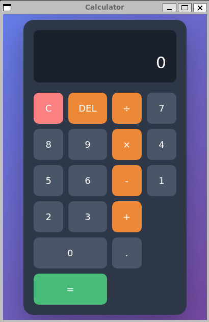

# Calculator Electron App



A minimal cross-platform calculator application built with Electron, TypeScript, and Vite.

## Features

- ✨ Modern, responsive calculator UI
- 🎨 Beautiful gradient design
- ⌨️ Full keyboard support
- 🏗️ Clean separation of concerns (UI, IPC, business logic)
- 🔒 Secure with context isolation enabled
- 🐛 Full debugging support with source maps

## Development

The initial project template was created with [electronforge](https://www.electronforge.io/templates/vite-+-typescript)

    npx create-electron-app@latest electron-calc --template=vite-typescript

### Prerequisites

- Node.js 18 or higher
- npm

### Install Dependencies

```bash
npm install
```

### Run in Development Mode

```bash
npm start
```

This will start the app with hot-reload enabled and DevTools open.

### Debugging

This project includes VS Code debug configurations:

1. Press `F5` in VS Code
2. Select "Electron: Main" from the dropdown
3. Set breakpoints in TypeScript files
4. Debug with full source map support

## Building

### Build for Current Platform

```bash
npm run package
```

### Create Distributables

```bash
npm run make
```

This creates platform-specific installers:
- **Linux**: `.deb`, `.rpm`, `.zip`
- **Windows**: `.exe` (Squirrel), `.msi` (WiX)
- **macOS**: `.zip`

### Linux Build Requirements

```bash
sudo apt-get update && sudo apt-get install -y rpm dpkg fakeroot zip
```

## Multi-Platform Builds

This project uses GitHub Actions to build for all platforms automatically.

### Automatic Builds

Every push to `main` triggers builds for:
- Linux (Ubuntu)
- Windows
- macOS

Download build artifacts from the GitHub Actions "Artifacts" section.

### Creating a Release

To create a GitHub release with all platform builds:

```bash
# Tag a new version
git tag v1.0.0
git push origin v1.0.0
```

This automatically:
1. Builds for all platforms
2. Creates a GitHub release
3. Uploads all installers as release assets

## Project Structure

```
src/
├── main.ts              # Main Electron process
├── preload.ts           # IPC bridge (context isolation)
├── calculator-logic.ts  # Business logic module
└── index.css           # Styles

index.html              # Calculator UI
forge.config.ts         # Electron Forge configuration
.github/workflows/      # CI/CD workflows
  ├── build.yml         # Multi-platform builds
  └── release.yml       # Automated releases
```

## Technology Stack

- **Electron** - Cross-platform desktop framework
- **TypeScript** - Type-safe JavaScript
- **Vite** - Fast build tool with HMR
- **Electron Forge** - Build and packaging toolchain

## Architecture

The app demonstrates clean separation of concerns:

- **Renderer Process** (index.html) - Handles UI and user input
- **Main Process** (main.ts) - Routes IPC messages
- **Business Logic** (calculator-logic.ts) - Performs calculations

This architecture makes the code:
- Testable (business logic is isolated)
- Maintainable (clear responsibilities)
- Secure (no Node.js in renderer)

## License

MIT

## Credits

Built with lots of help from Anthropic [Claude](https://claude.ai/new)
